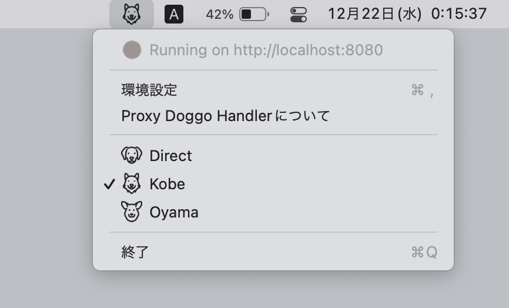
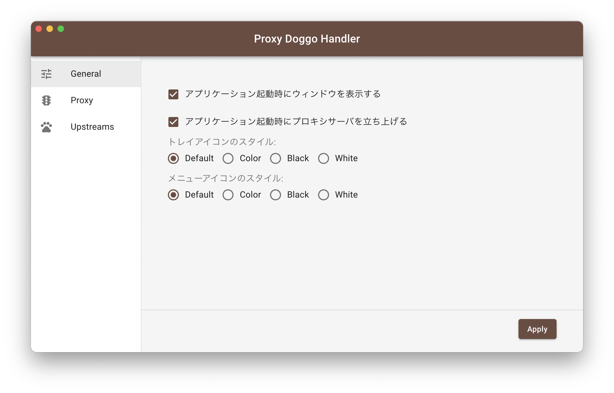
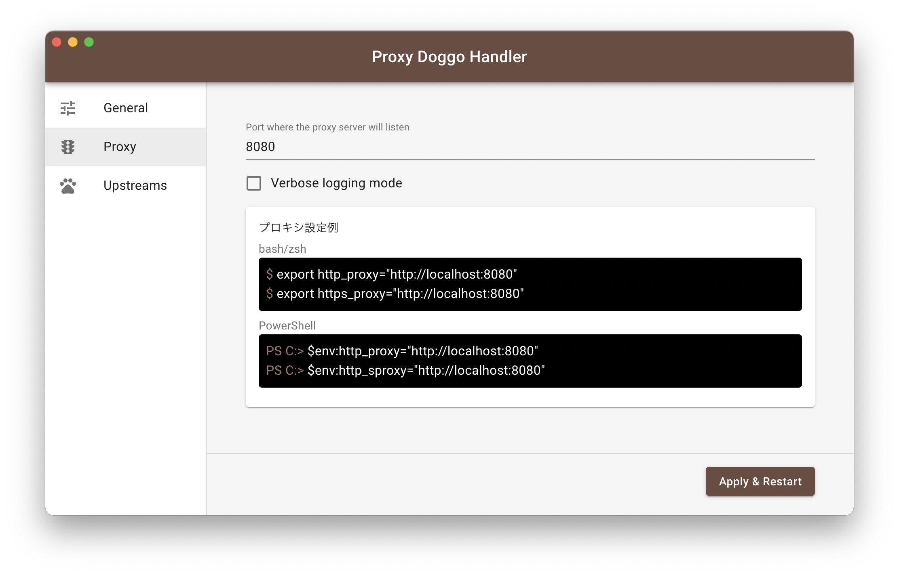
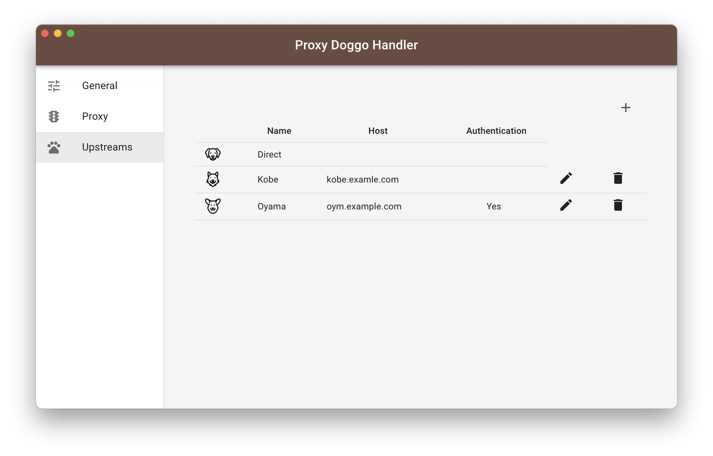

# Proxy Doggo Handler

Proxy integration and switching tool

## Build

```sh
## for macOS
$ npm run build:mac

## for Windows
### x64
$ npm run build:win64
### x86
$ npm run build:win632
```

## Screenshot






