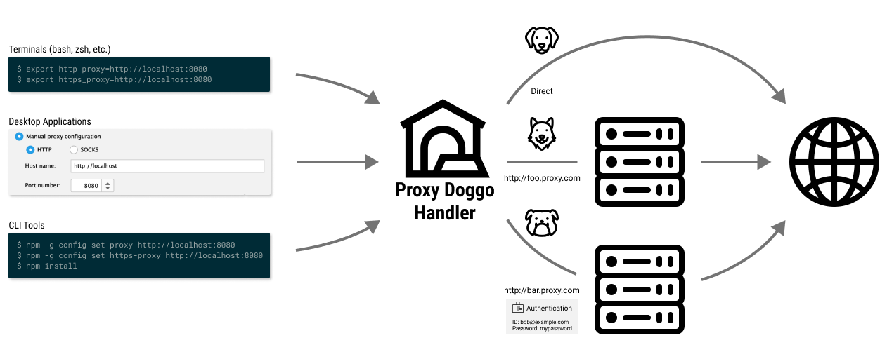
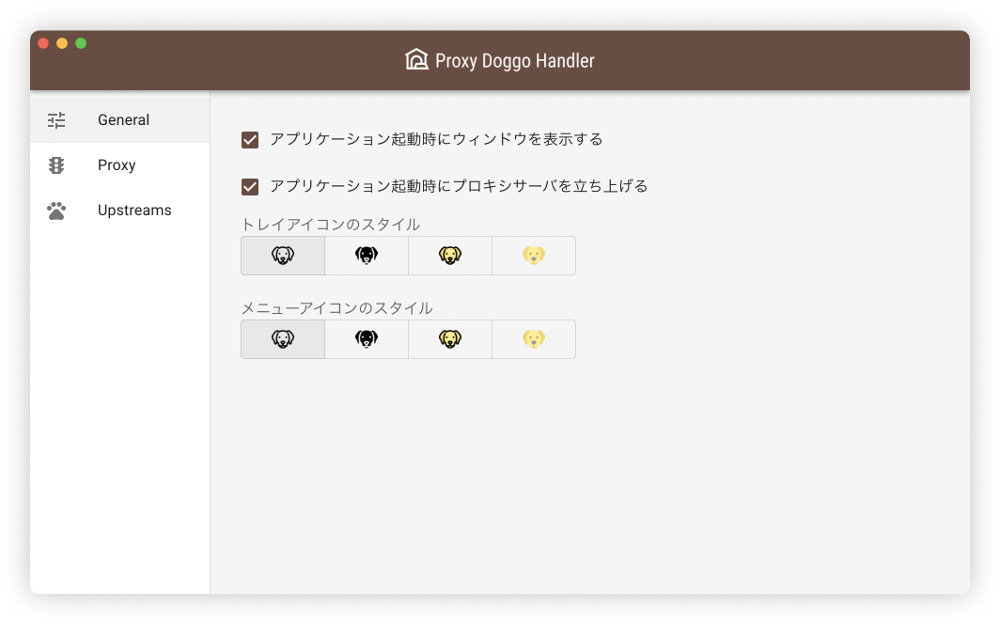
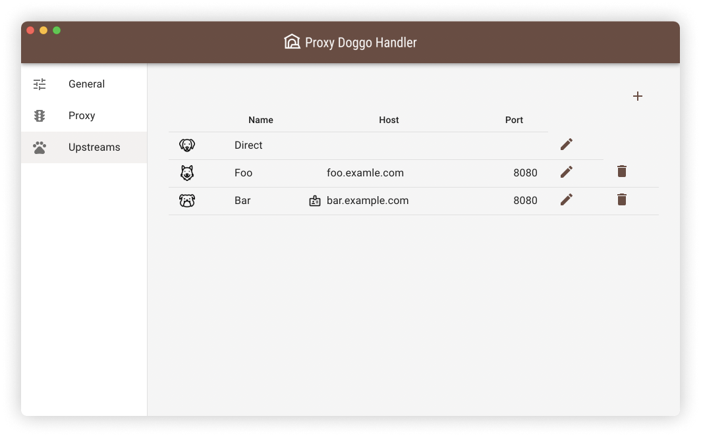

<h1 align="center">
  <br>
  <a href="https://github.com/yama07/ProxyDoggoHandler">
    
  </a>
  <br>
  Proxy Doggo Handler
  <br>
</h1>

<h4 align="center">Proxy integration and switching tool. For Mac, Windows.</h4>

## About

プロキシサーバの統合管理・切り替えツールです。
タスクトレイに常駐し、プロキシサーバの中継サーバを立ち上げます。

<p align="center">
  
</p>

各ツールのプロキシ設定を中継サーバにしておくことで、接続環境に応じたプロキシ設定の書き換えが不要になります。
また、認証プロキシに対する認証処理を中継サーバが代行するため、認証プロキシ非対応のアプリケーションを利用できるようになります。

## Install

🐶 Comming soon... 🐶

## Uninstall

🐶 Comming soon... 🐶

## Screenshot

<p align="center">
  
</p>

<p align="center">
  
  
  
</p>

## Development

### Get the code

```
$ git clone https://github.com/yama07/ProxyDoggoHandler
$ cd ProxyDoggoHandler
$ npm install
```

### Run the app

```
$ npm run dev
```

### Build

```sh
## for macOS
$ npm run build:mac

## for Windows
$ npm run build:win64
### or
$ npm run build:win632
```

## Thanks

<div>Icons made by <a href="https://www.flaticon.com/authors/vitaly-gorbachev" title="Vitaly Gorbachev">Vitaly Gorbachev</a> from <a href="https://www.flaticon.com/" title="Flaticon">www.flaticon.com</a></div>
