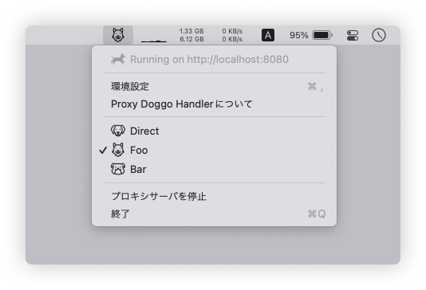

<h1 align="center">
  <br>
  <a href="https://github.com/yama07/ProxyDoggoHandler">
    
  </a>
  <br>
  Proxy Doggo Handler
  <br>
</h1>

<h4 align="center">Proxy integration and switching tool. For Mac, Windows.</h4>

<p align="center">🐶</p>

<p align="center">
  <a href="https://github.com/yama07/ProxyDoggoHandler"></a>
  <a href="https://github.com/yama07/ProxyDoggoHandler/releases"></a>
  <a href="https://github.com/yama07/ProxyDoggoHandler/blob/master/LICENSE"></a>
</p>

## About

プロキシの統合管理・切り替えツールです。
タスクトレイに常駐し、プロキシの中継サーバを立ち上げます。

<p align="center" display="flex">
  
  
</p>

各ツールのプロキシ設定に中継サーバを指定しておくことで、環境に応じたプロキシ設定の書き換えが不要になります。
中継サーバのアクセス先として、"認証なしプロキシ"、"認証プロキシ"、"直接アクセス"を登録することができ、タスクトレイのメニューから切り替えることができます。

また、認証プロキシに対する認証処理は中継サーバが代行するため、認証プロキシ非対応のアプリケーションを利用できるようになります。

<p align="center">
  
</p>

## Install

### Mac

[Releases ページ](https://github.com/yama07/ProxyDoggoHandler/releases)から`ProxyDoggoHandler-macos.dmg`をダウンロードし、アプリケーションフォルダなどにインストールしてください。

Intel(x64)マシン用にビルドしたアプリケーションファイルのため、実行には Rosetta 2 のインストールが必要です。
Apple Silicon(arm64)マシン用のアプリケーションファイルが必要な場合は、Apple Silicon Mac 上でソースコードからビルドしてください。

### Windows

[Releases ページ](https://github.com/yama07/ProxyDoggoHandler/releases)から`ProxyDoggoHandler-win-portable.exe`ファイルをダウンロードし、適切なフォルダに格納してください。

コード署名を行なっていないため、exe ファイルを実行した際に SmartScreen の**セキュリティ警告が表示される**ことがあります。
不安に感じる場合は、自身のマシン上でソースコードからビルドすることをお勧めします。

## Uninstall

### Mac

アプリケーションフォルダから Proxy Doggo Handler.app ファイルを削除してください。

また、以下のディレクトリにユーザデータやログが保存されるため、不要な場合は削除してください。

- `~/Library/Application Support/proxy-doggo-handler`
- `~/Library/Logs/proxy-doggo-handler`

### Windows

ProxyDoggoHandler-win-portable.exe ファイルを削除してください。

また、以下のフォルダにユーザデータやログが保存されるため、不要な場合は削除してください。

- `%USERPROFILE%\AppData\Roaming\proxy-doggo-handler`  
  (e.g. `C:\Users\yama07\AppData\Roaming\proxy-doggo-handler`)

## Screenshot

<p align="center" display="flex">
  
  
  
  
</p>

## Development

### Get the code

```
$ git clone https://github.com/yama07/ProxyDoggoHandler
$ cd ProxyDoggoHandler
$ npm install
```

### Run the app

```
$ npm run dev
```

### Build

```sh
$ npm run build

## or
$ npm run build:all
$ npm run build:win:ia32
$ npm run build:win:x64
$ npm run build:mac:x64
$ npm run build:mac:arm64
$ npm run build:mac:universal
```

## Thanks

<div>Icons made by <a href="https://www.flaticon.com/authors/vitaly-gorbachev" title="Vitaly Gorbachev">Vitaly Gorbachev</a> from <a href="https://www.flaticon.com/" title="Flaticon">www.flaticon.com</a></div>
